[toc]

# Common Inventory (Key-Value Store)

Will be provided via a Key-Value (KV) store, for the initial release ***etcd*** will be used. Any KV store must both provide a RESTful API and a server-side create-read-update-delete (CRUD) interface. Regarding choice of Key-Value store refer to [here](https://etcd.io/docs/v3.2.17/learning/why/) for comparison, though ***etcd*** v3.3 maximum database size is 10Gib; for details on performance related aspects refer [here](https://coreos.com/blog/announcing-etcd-3.3#:~:text=The%20maximum%20database%20size%20limit,an%20upper%2Dbound%20for%20recovery). While 10Gib is small to some SQL/NoSQL databases, KV Stores are designed to hold values against a key and not large quantities of data such as telemetry.

- in the case of binary/raw/large data such as IPDR, SNMP traps, SYSLOG events, the KV Store would hold a suitable pointer to an external URL (and/or filesystem entity)
- The KV Store itself does not have a predefined data model structure as is focused on key-value pairs; in order to provide structure the key name itself can include delimiter to represent a path; for example /country/state/town/district/street-name

Below is a representation of the functional capabilities and NOT the functional architecture nor final components surrounding the Key-Value store - these are included here to act as education aid of the proposed concepts of the KV Store:
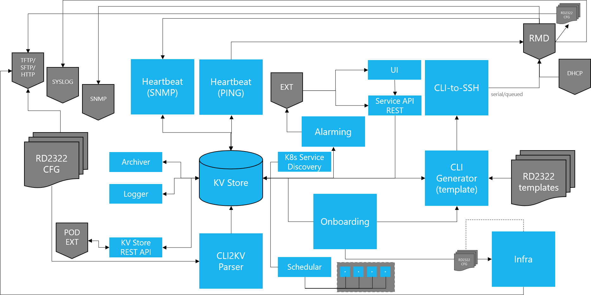

## Capabilities

- EXT: any external RESTful API endpoint either acting as server or client
- POD EXT: available across Kubernetes solution containers only and not exposed externally of the Kubernetes environment
- SYSLOG: receiver which serves to receive events and store within assigned Linux filesystem while updating KY Store with details (but not actual event data); when events received this component will update RMD (or other device) metadata to indicate health/availability status; this component can be configured to forward events to external SYSLOG receivers
- TFTP/SFTP/HTTP: hosted either within provider environment or within solution itself that acts as a file repository which can be accessed by the RMD (or other devices) through a multiple of protocols including TFTP, SFTP, HTTP; this solution will transfer any generated configuration files to this file repository for retrieval from RMD (or other devices). Authentication of the file repository will be via supported means of the file repository and not necessarily integrated to IAM component
- DHCP: external DHCP server(s) hosted within provider environment; these are expected to have the defined DHCP scopes with necessary address pools and DHCP options
- SNMP: external receiver that the RMD (or other device) may be configured to send traps to; it remains as an external element and should not be confused with Heartbeat (SNMP)
- UI: as it suggests
- Service API REST: the external facing northbound API for lifecycle operations and platform administration
- KV Store:
    -  the KV Store must support encrypted data at rest, meaning all stored key-values must be encrypted (while meeting regulatory/export requirements)
    - the KV Store must either support case insensitive key-names or force key-names to be common case (lower), otherwise any external capability must also have the same matching key-name case used
    - KV Store REST API - RESTful API server application supporting CRUD operations for the KV Store
        - the kV Store is expected to offer both RESTful API and script/language interfaces as such this capability may be consumed by the KV Store capability
- Heartbeat:
	- SNMP: receiver which serves to receive traps and store within assigned Linux filesystem while updating KY Store with details (but not actual trap data); when traps received this component will update RMD (or other device) metadata to indicate health/availability status
	- PING: wrapper to issue ICMP PING requests to each and every RMD (or other device), updating KV Store RMD (or other device) metadata to indicate health/availability status;
	- Heartbeat/alive indication is formed of series of (EPOCH) timestamps when communication should occur:
    - `first`
    - `last`
    - `next-expected`
	- Aspects required for use of ICMP PING, such as timeout, Time-To-Live (`TTL`), packet count, packet interval are held within common elements within KV Store
- CLI2KV - wrapper to parse CLI configuration files (or individual CLI commands) and update the reflective device model within the KV Store; in the case of RMD then device model can follow CLI model but should (eventually) be a common format
- Alarming - monitors KV store on a per RMD (or other device model) basis, calculates when RMD is next expected to send heartbeat alive (SNMP trap or respond to ICMP PING) in a successful manner; if the next-expected timestamp has been passed without positive alive indication, update KV Store RMD threshold counter and optionally notify external assurance system (ServAssure) of the event through RESTful API call
- Onboarding - monitors KV store for new RMD (or other device model), and for any found perform a series of predefined actions which result in the RMD being operational; the RMD can be onboarded either PRIOR to network installation (i.e. upon receipt in provider warehouse) or after installation. Until RMD has been processed for onboarding there will be no specification configuration available for that RMD unit.
    - There is no direct interaction between Heartbeat, Alarming or other components, monitoring (or watching) changes or new additions to the KV Store must be sufficient to ensure solution remains data-driven
- RD2322 templates: parametrised CLI templates which are device model-family/type specific; the order of the text within the template will be maintained by any processing the template allowing configuration dependencies to be managed
- CLI Generator: parses RMD (or other device) CLI templates and substitutes parameters with values retrieved from KV Store, subsequently generating a nominated CLI configuration file; this is expected to be driven by alternative capability (i.e. Onboarding)
- CLI-to-SSH: responsible for delivering generated CLI instructions directly to RMD (or other device) over SSH, once retrieving the appropriate RMD credentials via the KV Store.
    - This capability must also ensure a sequential feed to the RMD (or other device) through KV Store based queue mechanism, ensuring configuration changes are applied in the original intended order.
    - The capability must support automatic retries and attempt delays (via KV Store held application defaults) with updating the KV Store with appropriate failures indicators
    - Infra: responsible for delivering generated CLI configuration files to appropriate file repository by means of locating correct repository via KV Store lookup; optionally this may also issue DHCP client request in order to receive available defined DHCP options to update the KV Store for subsequent inclusion within any generated CLI configuration
- K8S Service Discovery: Service discovery in Kubernetes can be achieved via the cluster K8S DNS (recommended) or via environment variables on the nodes, refer to [here](https://kubernetes.io/docs/concepts/services-networking/service/#dns)
- Scheduler: a CRON-style execution manager responsible for performing specified tasks at specified times/frequency
- Infra: tbc
- Archiver: tbc
- Logger: tbc


In order to act as a solution-wide inventory, the KV Store should be treated as logically separated:

- `/system` - system-wide application defaults
- `/defaults` - application or device specific defaults
- `/templates` - KV store hosting CLI configuration  templates; this is optional and filesystem hosted templates could be used instead
- `/inventory` - a series of read-only links to other entities (branch or leaf) providing a summary typically used for traversing through the structure to find details (e.g. RMD UUID)
- `/{{tenant}}/{{region}}/{{zone}}/{{device UUID}}` - simple hierarchy for providers presenting multi-tenancy; where multi-tenancy is not required tenant can be defaulted to provider name, though region/zone is still expected to represent some form of geographic format, e.g. `/charter/georgia/gainesville` would be a container for all RMDs located within or associated with the city of Gainesville, Georgia within the USA.
	- Every RMD (or other device) within the KV store makes use of universally unique identifier (UUIDv4) to represent the device, the UUID is generated extremally from the RMD


The summary structure of the KV store is shown below:

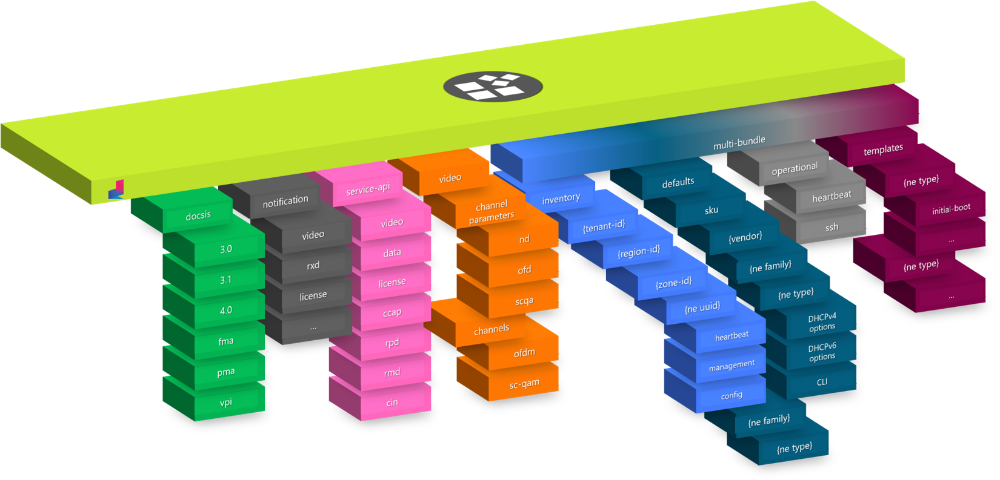

### `/system`
Within `/system`, application defaults could be held and these typically would include those shown below and would include such values as SSH operation timeouts/retires, ICMP PING operation southbound towards the RMD:
- `/system/heartbeat/timeout "5"`
- `/system/heartbeat/ttl "10"`
- `/system/heartbeat/count "1"`
- `/system/heartbeat/interval "60"`
- `/system/ssh/timeout "5"`
- `/system/ssh/max-wait "300"`
- `/system/ssh/max-retries "3"`
- `/system/ssh/retry-interval "300"`

Visualising the /system branch within the KV store at this stage would show structure similar to:
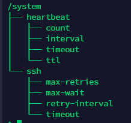

### `/defaults`
Within `/defaults`, generic values for RMD (or other device), RMD related DHCP options, device-specific (model family/type) CLI commands for NVRAM operations as well as default credentials should be held:
- `/defaults/sku/CommScope/RMD/RD2322/dhcpv4/options/1 "255.255.255.0" # subnet mask`
- `/defaults/sku/CommScope/RMD/RD2322/dhcpv4/options/3 "10.172.16.1" # list of routers`
- `/defaults/sku/CommScope/RMD/RD2322/dhcpv4/options/4 "10.1.1.1" # Time of Day (TOD) server`
- `/defaults/sku/CommScope/RMD/RD2322/dhcpv4/options/6 "10.171.1.1" # DNS server`
- `/defaults/sku/CommScope/RMD/RD2322/dhcpv4/options/7 "10.172.16.2" # log server`
- `/defaults/sku/CommScope/RMD/RD2322/dhcpv4/options/42 "10.172.16.2" # NTP server`
- `/defaults/sku/CommScope/RMD/RD2322/dhcpv4/options/67 "tftp://rmdmgr1:2597/rd2322.default.cfg" # bootfile URL`
- `/defaults/sku/CommScope/RMD/RD2322/dhcpv4/options/100 "EST5EDT4,M3.2.0/02:00,M11.1.0/02:00" # time zone`
- `/defaults/sku/CommScope/RMD/RD2322/dhcpv4/options/101 "America/New_York" # time zone`
- `/defaults/sku/CommScope/RMD/RD2322/cli/ssh-idle-timeout-duration "600"`
- `/defaults/sku/CommScope/RMD/RD2322/cli/ssh-idle-timeout "ip ssh idle-timeout"`
- `/defaults/sku/CommScope/RMD/RD2322/cli/erase-config "erase nvram"`
- `/defaults/sku/CommScope/RMD/RD2322/cli/reset-config "reset nvram"`
- `/defaults/sku/CommScope/RMD/RD2322/cli/save-config "write memory"`
- `/defaults/sku/CommScope/RMD/RD2322/cli/copy-config "copy running-config verbose"`
- `/defaults/sku/CommScope/RMD/RD2322/cli/enable-username "admin"`
- `/defaults/sku/CommScope/RMD/RD2322/cli/enable-password "admin"`
- `/defaults/sku/CommScope/FastIron/ICX-7850/cli/enable-username "admin"`
- `/defaults/sku/CommScope/FastIron/ICX-7850/cli/enable-password "admin"`

*Default values for CLI credentials should be copied to instances of defined RMD (or other device) as a default value, where as others should be referenced as a linked (read-only) value.*

Visualising the `/defaults` branch within the KV store at this stage would show structure similar to:
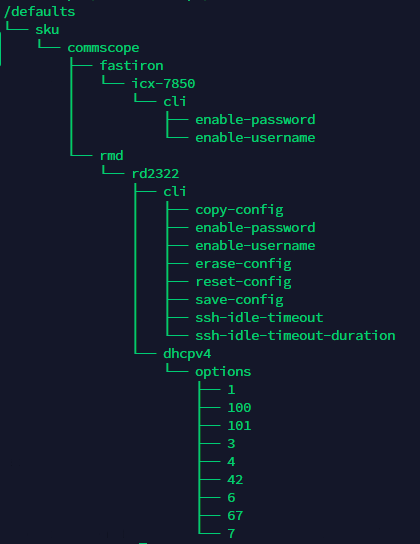

### `/templates`
Within `/templates`, CLI templates could be linked to `/defaults`for RMD models for standard configurations, at this stage is not used.

### `/{{tenant}}/{{region}}/{{zone}}/{{device UUID}}`
While the solution is initially focused on management of RMD RD2322 devices, other devices such as those used to represent the CIN infrastructure (leaf/spine) should be defined within the KV store, a simple model of the leaf/spine devices can be defined, example for spine device follows though expectation is to have minimal supported number of spine and leaf devices:
- `/Charter/dc/core/{{UUID}}/management/ip-address "10.172.10.4"`
- `/Charter/dc/core/{{UUID}}/management/ssh/public-key/key-type "RSA"`
- `/Charter/dc/core/{{UUID}}/management/ssh/public-key/key-value "/store/{{UUID}}/id_rsa.ppk"`
- `/Charter/dc/core/{{UUID}}/management/ssh/host-based/key-type ""`
- `/Charter/dc/core/{{UUID}}/management/ssh/host-based/key-value ""`
- `/Charter/dc/core/{{UUID}}/management/ssh/fingerprint ""`
- `/Charter/dc/core/{{UUID}}/management/snmp/community/read-only "ro"`
- `/Charter/dc/core/{{UUID}}/management/snmp/community/read-write "rw"`
- `/Charter/dc/core/{{UUID}}/management/snmp/community/trap "any"`
- `/Charter/dc/core/{{UUID}}/management/snmp/agent-version "v3"`
- `/Charter/dc/core/{{UUID}}/management/snmp/agent-port "161"`
- `/Charter/dc/core/{{UUID}}/management/role "spine"`
- `/Charter/dc/core/{{UUID}}/config/interfaces/ethernet/1/1/1/mac-address "cc4e.24a4.18c0"`
- `/Charter/dc/core/{{UUID}}/config/interfaces/ethernet/1/1/1/duplex "full"`
- `/Charter/dc/core/{{UUID}}/config/interfaces/ethernet/1/1/1/speed "10G"`
- `/Charter/dc/core/{{UUID}}/config/interfaces/ethernet/1/1/1/trunk "none"`
- `/Charter/dc/core/{{UUID}}/config/interfaces/ethernet/1/1/1/tag "true"`
- `/Charter/dc/core/{{UUID}}/config/interfaces/ethernet/1/1/1/pvid "0"`
- `/Charter/dc/core/{{UUID}}/config/interfaces/ethernet/1/1/1/name ""`
- `/Charter/dc/core/{{UUID}}/config/interfaces/ethernet/1/1/1/ip-address "10.172.16.4"`
- `/Charter/dc/core/{{UUID}}/config/interfaces/ethernet/1/1/1/subnet-mask "255.255.255.0"`
- `/Charter/dc/core/{{UUID}}/config/interfaces/ethernet/1/1/1/subnet-bits "24"`
- `/Charter/dc/core/{{UUID}}/config/interfaces/ethernet/1/1/2/mac-address "cc4e.25a4.18c0"`
- `/Charter/dc/core/{{UUID}}/config/interfaces/ethernet/1/1/2/duplex "full"`
- `/Charter/dc/core/{{UUID}}/config/interfaces/ethernet/1/1/2/speed "10G"`
- `/Charter/dc/core/{{UUID}}/config/interfaces/ethernet/1/1/2/trunk "none"`
- `/Charter/dc/core/{{UUID}}/config/interfaces/ethernet/1/1/2/tag "true"`
- `/Charter/dc/core/{{UUID}}/config/interfaces/ethernet/1/1/2/pvid "0"`
- `/Charter/dc/core/{{UUID}}/config/interfaces/ethernet/1/1/2/name ""`
- `/Charter/dc/core/{{UUID}}/config/interfaces/ethernet/1/1/2/ip-address "10.172.17.4"`
- `/Charter/dc/core/{{UUID}}/config/interfaces/ethernet/1/1/2/subnet-mask "255.255.255.0"`
- `/Charter/dc/core/{{UUID}}/config/interfaces/ethernet/1/1/2/subnet-bits "24"`

CLI credentials can be defaulted (copied) from existing KV Store values, otherwise the values must be supplied like any other KV pairs:
- `/defaults/sku/CommScope/FastIron/ICX-7850/cli/enable-username → /Charter/dc/core/{{UUID}}/management/ssh/password/username`
- `/defaults/sku/CommScope/FastIron/ICX-7850/cli/enable-password→ /Charter/dc/core/{{UUID}}/management/ssh/password/password`

To aid auditing purposes, additional metadata should be added:
- `/Charter/dc/core/{{UUID}}/created "$(date '+%s')"`
- `/Charter/dc/core/{{UUID}}/modified ""`
- `/Charter/dc/core/{{UUID}}/deleted ""`

And any added device should be linked to the /inventory partition aiding retrieval:
- `/Charter/dc/core/{{UUID}} → /inventory/Charter/dc/core/{{UUID}}`

Visualising the KV store on the `/charter/dc` branch at this stage would show structure similar to:
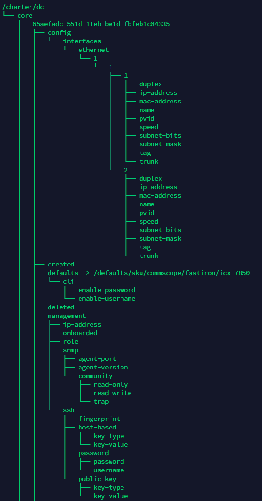

For RMD they would typically follow a similar model; this part of the device model is to serve only for supplying data to allow solution to reach, access and for the RMD to boot from external elements - RMD CLI configuration metadata will be held under a related branch either updated via the CLI-to-KV capability or REST API server (from external sources):
- `/defaults/sku/CommScope/RMD/RD2322 → /Charter/Georgia/Gainesville/{UUID}}/defaults`
- `/Charter/Georgia/Gainesville/{UUID}}/management/onboarded "false"`
- `/Charter/Georgia/Gainesville/{UUID}}/management/ip-address "10.172.16.23"`
- `/Charter/Georgia/Gainesville/{UUID}}/management/mac-address "c4:24:a3:45:fc:29"`
- `/Charter/Georgia/Gainesville/{UUID}}/management/bootfile-url "tftp://rmdmgr1:2597/rd2322.c4.24.a3.45.fc.29.cfg"`
- `/Charter/Georgia/Gainesville/{UUID}}/management/ssh/port "22"`
- `/Charter/Georgia/Gainesville/{UUID}}/management/ssh/authentication-method "password"`
- `/Charter/Georgia/Gainesville/{UUID}}/management/ssh/password/username "admin"`
- `/Charter/Georgia/Gainesville/{UUID}}/management/ssh/password/password ""`
- `/Charter/Georgia/Gainesville/{UUID}}/management/ssh/public-key/key-type "RSA"`
- `/Charter/Georgia/Gainesville/{UUID}}/management/ssh/public-key/key-value "/store/{UUID}}/id_rsa.ppk"`
- `/Charter/Georgia/Gainesville/{UUID}}/management/ssh/host-based/key-type ""`
- `/Charter/Georgia/Gainesville/{UUID}}/management/ssh/host-based/key-value ""`
- `/Charter/Georgia/Gainesville/{UUID}}/management/ssh/fingerprint ""`
- `/Charter/Georgia/Gainesville/{UUID}}/management/cli/copy-config-remote "copy running-config verbose tftp://rmdmgr1:2597/rmd.c4.24.a3.45.fc.29.cfg"`
- `/Charter/Georgia/Gainesville/{UUID}}/management/snmp/community/read-only "ro"`
- `/Charter/Georgia/Gainesville/{UUID}}/management/snmp/community/read-write "rw"`
- `/Charter/Georgia/Gainesville/{UUID}}/management/snmp/community/trap "any"`
- `/Charter/Georgia/Gainesville/{UUID}}/management/snmp/agent-version "v3"`
- `/Charter/Georgia/Gainesville/{UUID}}/management/snmp/agent-port "161"`

In order to provide a historic representation of CLI configuration files, the RMD (or other device) may include additional metadata allowing for a rolling list of revisions:
- `/Charter/Georgia/Gainesville/{UUID}}/config/history-to-keep "2"`
- `/Charter/Georgia/Gainesville/{UUID}}/config/history/1/store "/store/{UUID}}/rd2322.c4.24.a3.45.fc.29.cfg.1"`
- `/Charter/Georgia/Gainesville/{UUID}}/config/history/1/created "$(date '+%s')"`
- `/Charter/Georgia/Gainesville/{UUID}}/config/history/1/modified ""`
- `/Charter/Georgia/Gainesville/{UUID}}/config/history/1/deleted ""`
- `/Charter/Georgia/Gainesville/{UUID}}/config/history/2/store "/store/{UUID}}/rd2322.c4.24.a3.45.fc.29.cfg.2"`
- `/Charter/Georgia/Gainesville/{UUID}}/config/history/2/created ""`
- `/Charter/Georgia/Gainesville/{UUID}}/config/history/2/modified ""`
- `/Charter/Georgia/Gainesville/{UUID}}/config/history/2/deleted ""`

CLI credentials can be defaulted from existing KV Store values, otherwise the values can be supplied like any other KV pairs:
- `/defaults/sku/CommScope/RMD/RD2322/cli/enable-username → /Charter/Georgia/Gainesville/{UUID}}/management/cli/enable-username`
- `/defaults/sku/CommScope/RMD/RD2322/cli/enable-password → /Charter/Georgia/Gainesville/{UUID}}/management/cli/enable-password`

To aid auditing/tracking purposes, additional metadata should be added - the KV Store will NOT automatically add this metadata in this fashion but may provide alternative methods providing similar information:
- `/Charter/Georgia/Gainesville/{UUID}}/created "$(date '+%s')"`
- `/Charter/Georgia/Gainesville/{UUID}}/modified ""`
- `/Charter/Georgia/Gainesville/{UUID}}/deleted ""`

To aid heartbeat tracking purposes, additional metadata should be added to each RMD - these will be populated via the onboarding and heartbeat capabilities:
- `/Charter/Georgia/Gainesville/{UUID}}/heartbeat/first ""`
- `/Charter/Georgia/Gainesville/{UUID}}/heartbeat/last ""`
- `/Charter/Georgia/Gainesville/{UUID}}/heartbeat/next-expected "$(date -d "+60 minutes" '+%s')"`

And any added device should be linked (pointer) to the `/inventory` partition aiding retrieval:
- `/Charter/Georgia/Gainesville/{UUID}} → /inventory/Charter/Georgia/Gainesville/{UUID}}`

Visualising the KV store on the /charter branch at this stage would show structure similar to:
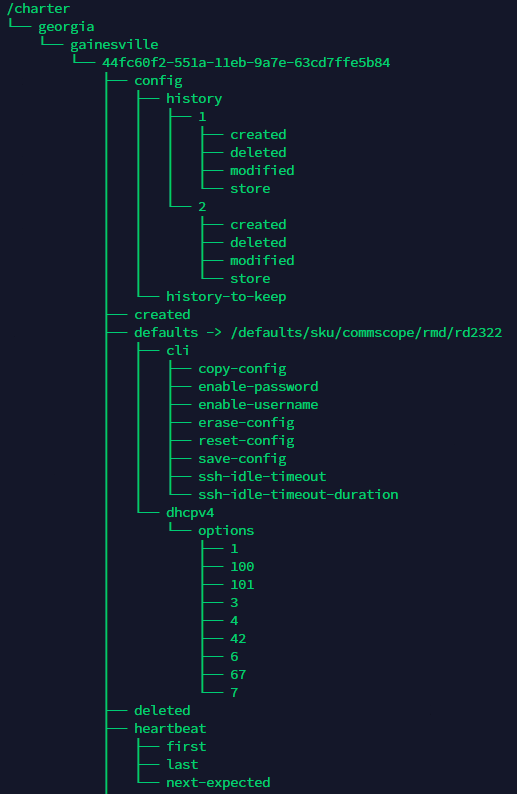
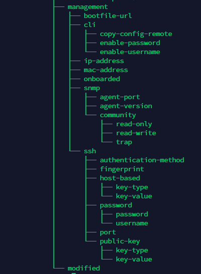


## Templates

In this section, `${TENANT_ID}`, `${REGION_ID}`, `${ZONE_ID}` and `${UUID_ID}` (previously shown as `${RMD_ID}`) are parameters that are passed via the execution method, typically these values would be extracted from the KV Store (see next section) but for clarity (and the languages used) passed via the command line interface:
- `--tenant charter → ${TENANT_ID}`
- `--region georgia → ${REGION_ID}`
- `--zone gainesville → ${ZONE_ID}`
- ~~--rmd~~ `--uuid 44fc60f2-551a-11eb-9a7e-63cd7ffe5b84 → ${UUID_ID}`

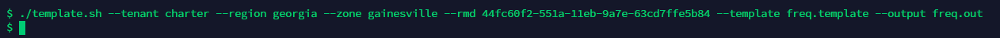

Once data is populated, the onboarding process would typically use a previously defined device specific (i.e. RD2322) template to generate the default boot configuration file; such a CLI template would look similar to:

```
configure {{/${TENANT_ID}/${REGION_ID}/${ZONE_ID}/${RMD_ID}/defaults/cli/ssh-idle-timeout}} {{/${TENANT_ID}/${REGION_ID}/${ZONE_ID}/${RMD_ID}/defaults/cli/ssh-idle-timeout-duration}}
configure ip interface ip address {{/${TENANT_ID}/${REGION_ID}/${ZONE_ID}/${RMD_ID}/management/ip-address}}
configure ip bootfile {{/${TENANT_ID}/${REGION_ID}/${ZONE_ID}/${RMD_ID}/management/bootfile-url}}
...
...
configure ntp server {{/${TENANT_ID}/${REGION_ID}/${ZONE_ID}/${RMD_ID}/defaults/dhcpv4/options/42}}
```

Parameters shown by `{{ KV path/key-name }}` would be replaced with those values held at the specified key-value leaf, and using the prior simple template example, would result in generating the CLI configuration:

```
configure ip ssh idle-timeout 600
configure ip interface address 10.172.16.23
configure ip bootfile tftp://rmdmgr1:2597/rd2322.c4.24.a3.45.fc.29.cfg
...
...
configure ntp server 10.172.16.2
```

Further example for a specific RMD license key KV Store structure holding metadata would be similar to:
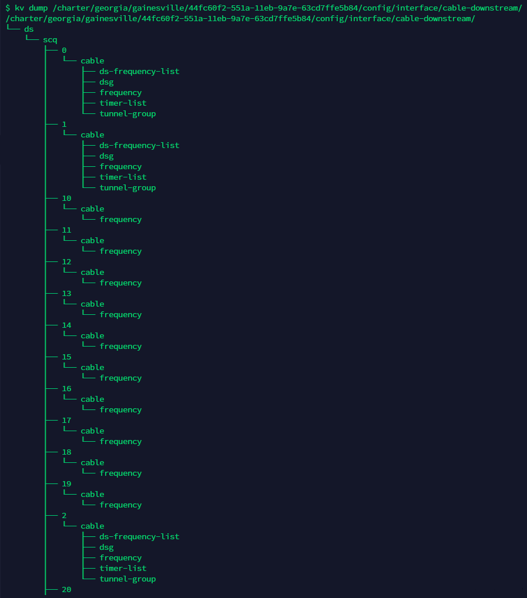


A matching CLI template snippet would look similar to:

```
#Licenses for RMD-2
configure license type downstream-service-group key {{/${TENANT_ID}/${REGION_ID}/${ZONE_ID}/${RMD_ID}/config/license/downstream-service-group/key}} count {{/${TENANT_ID}/${REGION_ID}/${ZONE_ID}/${RMD_ID}/config/license/downstream-service-group/count}}

configure license type upstream-service-group key {{/${TENANT_ID}/${REGION_ID}/${ZONE_ID}/${RMD_ID}/config/license/upstream-service-group/key}} count {{/${TENANT_ID}/${REGION_ID}/${ZONE_ID}/${RMD_ID}/config/license/upstream-service-group/count}}

configure license type mac-docsis-ds-30-B key {{/${TENANT_ID}/${REGION_ID}/${ZONE_ID}/${RMD_ID}/config/license/mac-docsis-ds-30-B/key}} count {{/${TENANT_ID}/${REGION_ID}/${ZONE_ID}/${RMD_ID}/config/license/mac-docsis-ds-30-B/count}}

configure license type mac-docsis-us-30 key {{/${TENANT_ID}/${REGION_ID}/${ZONE_ID}/${RMD_ID}/config/license/mac-docsis-us-30/key}} count {{/${TENANT_ID}/${REGION_ID}/${ZONE_ID}/${RMD_ID}/config/license/mac-docsis-us-30/count}}

configure license type mac-docsis-ds-ofdm key {{/${TENANT_ID}/${REGION_ID}/${ZONE_ID}/${RMD_ID}/config/license/mac-docsis-ds-ofdm/key}} count {{/${TENANT_ID}/${REGION_ID}/${ZONE_ID}/${RMD_ID}/config/license/mac-docsis-ds-ofdm/count}}

configure license type mac-docsis-us-ofdma key {{/${TENANT_ID}/${REGION_ID}/${ZONE_ID}/${RMD_ID}/config/license/mac-docsis-us-ofdma/key}} count {{/${TENANT_ID}/${REGION_ID}/${ZONE_ID}/${RMD_ID}/config/license/mac-docsis-us-ofdma/count}}

configure license type system-legal-intercept key {{/${TENANT_ID}/${REGION_ID}/${ZONE_ID}/${RMD_ID}/config/license/system-legal-intercept/key}} count {{/${TENANT_ID}/${REGION_ID}/${ZONE_ID}/${RMD_ID}/config/license/system-legal-intercept/count}}

configure license type system-laes key {{/${TENANT_ID}/${REGION_ID}/${ZONE_ID}/${RMD_ID}/config/license/system-laes/key}} count {{/${TENANT_ID}/${REGION_ID}/${ZONE_ID}/${RMD_ID}/config/license/system-laes/count}}

configure license type system-calea key {{/${TENANT_ID}/${REGION_ID}/${ZONE_ID}/${RMD_ID}/config/license/system-calea/key}} count {{/${TENANT_ID}/${REGION_ID}/${ZONE_ID}/${RMD_ID}/config/license/system-calea/count}}
```

Parameters are again shown by `{{ KV path/key-name }}` would be replaced with those values held at the specified key-value leaf, and using the prior simple template example, would result in generating the CLI configuration:

```
#Licenses for RMD-2
configure license type downstream-service-group key FDA208349C6E914A0001 count 2
configure license type upstream-service-group key 98F38653FA458D6E0001 count 2
configure license type mac-docsis-ds-30-B key BD93A1C0F731470F0001 count 10000
configure license type mac-docsis-us-30 key EC64CA1C45E7578F0001 count 10000
configure license type mac-docsis-ds-ofdm key 7001FCD7BE6A73EA0001 count 500000
configure license type mac-docsis-us-ofdma key EFF88C91CA7CFF780001 count 500000
configure license type system-legal-intercept key C2E893268786398C0001 count 1
configure license type system-laes key ECA9202724D9CD1B0001 count 1
configure license type system-calea key 9531465A6D450AF90001 count 1
```

Not all configuration data is mandatory on the RMD, in addition multiple values can exist for the same single CLI instruction (`configure ntp server ...`), as such the template mechanism must allow for templated text to either be populated with one or more occurrences of data held within the KV Store or for the templated text to be removed from any generated output - the KV Store must be modelled to support indexes of data in a similar fashion to:
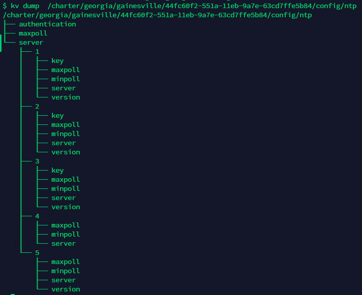

The template below shows a mix of static and optional/multiple mapping, example includes `cable-multistream` which does not exist within the KV Store and thus should not appear in any generated CLI output:

```
# static single (mandatory existence) mapping
configure license type downstream-service-group key {{/${TENANT_ID}/${REGION_ID}/${ZONE_ID}/${RMD_ID}/config/license/downstream-service-group/key}} count {{/${TENANT_ID}/${REGION_ID}/${ZONE_ID}/${RMD_ID}/config/license/downstream-service-group/count}}

# optional multiple mapping - will map to defined downstream frequencies
<<configure interface cable-downstream ds/scq/?/${TENANT_ID}/${REGION_ID}/${ZONE_ID}/${RMD_ID}/config/interface/cable-downstream/ds/scq cable?cable frequency?frequency %<<

# optional multiple mapping - will not map as is rubbish but serves to demonstrate
<<configure interface cable-multistream ms/scq/?/${TENANT_ID}/${REGION_ID}/${ZONE_ID}/${RMD_ID}/config/interface/cable-multistream/ms/scq cable?cable frequency?frequency %<<

# another single static
configure ntp server {{/${TENANT_ID}/${REGION_ID}/${ZONE_ID}/${RMD_ID}/defaults/dhcpv4/options/42}}
```

After processing the generated CLI configuration output would be similar to below and can be passed to the CLISSH capability for applying to the specified RMD:
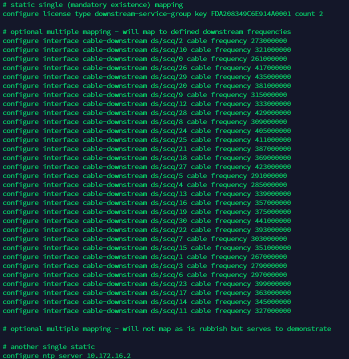


- A full default template for each RMD (per model-family/type) or other device must be provided as part of the solution

## Monitoring/tracking Changes within the Key-Value Store

- In the case of RMD, the model construct includes metadata for auditing such as `/Charter/Georgia/Gainesville/{UUID}}/created`, `/Charter/Georgia/Gainesville/{UUID}}/modified` and `/Charter/Georgia/Gainesville/{UUID}}/deleted`. It is the responsibility of the capabilities to ensure these values are populated accordingly whenever a value submitted to the KV Store is changed.
- Whatever capability adds the RMD to the KV Store, should also populated ./created; the onboarding and heartbeat capabilities should set ./modified when the RMD is finally onboarded or heartbeat timestamps are updated.
- The CLI2KV capability also has to update ./modified value but only after checking if a key-value actually exists and the value is different; these has the added advantage of drastically reducing the processing time of parsing CLI configurations (after the initial parsing)
- Solution capabilities are able to retrieve sub-keys for a given parent-key and, in the case of RMD, query the modified value to determine firstly if something has changed and secondly when something changed (44 seconds to create on initial phasing, 32 seconds on subsequent parsiing - due to language being used this needs to be reduced by factor of 10). The onboarding and heartbeat capabilities make use of the sub-key retrieval principle to determine what tenants, regions, zones and RMD should be processed
- Other capabilities, external or within the solution must be able to register a watch request (subscription to supply notification of change) to the KV Store through available interfaces and the KV Store must support a REST HTTP callback (with originator supplied payload) or a server-side command to execute. In order to determine which RMD has been modified, much like the onboarding and heartbeat capabilities, the sub-keys should be retrieved in order to determine the list of UUIDs for each RMD. At that stage the modified key-value can be watched for changes.
- The KV Store may automatically support propagation of modifications throughout a KV tree allow greater convince of detecting newly created data rather than traversing the data and checking each sub-key. The Baldrick prototype KV-store also allows keys to be listed which have been modified since a specified date/time (timestamp format `hh:mm mm/dd/yyyy`) or within the last minute:

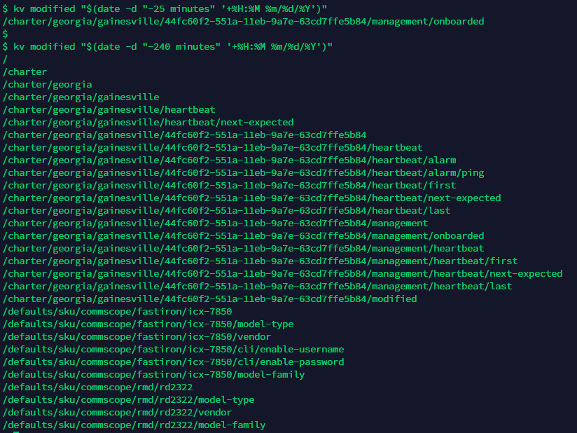


## Onboarding
...tbc

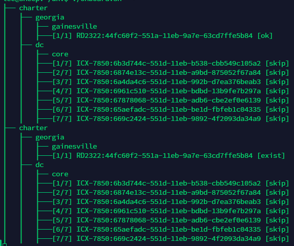


## Heartbeat

### PING
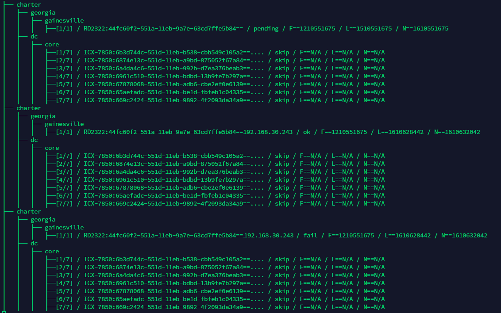

### SNMP
...tbc

## Alarming
...tbc
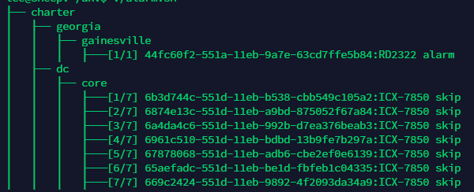

## CLI-to-KV (CLI2KV)
Parsing configuration data of the RMD is important to ensure KV Store and RMD are synchronised, CLI2KV capability serves to parse a RMD generated.

In order to provide a unified KV Store model, the CLI parser must process the individual CLI instructions and store any updated metadata in the KV Store, adding indexes where none exist within the CLI data to allow the template capability to simply process. For example the RMD CLI follows a range of patterns, these include but not limited to:
- last verb (value) (`extract_simple`)
- specific pairs within a CLI instruction (`extract_pair`)
- last pairs at the end of a CLI instruction (`extract_last_pair`)
- reformat block (interface/banner etc.) to sequential CLI instructions (`extract_block`)

Using the example RMD access-list CLI configuration as an example:

```
configure access-list 1  permit 192.168.226.0 0.0.0.255
configure access-list 1  permit 192.168.28.0 0.0.0.255
configure access-list 1  permit 192.168.216.0 0.0.0.255
configure access-list 1  permit 10.68.79.0 0.0.0.255
configure access-list 1  permit 200.83.0.0 0.0.0.255
configure access-list 1  permit 200.83.4.28
configure access-list 1  permit 192.168.17.0 0.0.0.255
configure access-list 1  permit 192.168.32.0 0.0.0.255
configure access-list 1  permit 192.168.34.0 0.0.0.255
configure access-list 1  permit 192.168.217.0 0.0.0.255
configure access-list 1  permit 192.168.220.0 0.0.0.255
configure access-list 1  permit 172.17.16.0 0.0.0.255
configure access-list 1  permit 192.168.247.0 0.0.0.255
configure access-list 1  permit 172.17.18.0 0.0.0.255
configure access-list 1  permit 172.17.24.0 0.0.0.255
configure access-list 1  permit 172.28.78.0 0.0.0.255
configure access-list 1  permit 172.17.36.0 0.0.0.255
configure access-list 1  permit 172.17.37.0 0.0.0.255
configure access-list 1  permit 172.17.107.0 0.0.0.255
configure access-list 1  permit 172.17.178.0 0.0.0.255
configure access-list 1  permit 172.17.38.0 0.0.0.255
configure access-list 1  permit 172.17.39.0 0.0.0.255
configure access-list 1  permit 172.17.43.0 0.0.0.255
configure access-list 1  permit 172.17.54.0 0.0.0.255
configure access-list 1  permit 172.17.164.0 0.0.0.255
configure access-list 1  permit 172.17.116.2
configure access-list 1  permit 172.17.65.43
configure access-list 1  permit 172.23.2.160
configure access-list 1  permit 172.17.58.135
configure access-list 1  permit 172.17.193.203
configure access-list 1  permit 172.17.197.8
configure access-list 1  permit 172.17.56.114
configure access-list 1  permit 172.17.102.137
configure access-list 1  permit 172.17.125.39
configure access-list 1  permit 172.17.125.21
configure access-list 1  permit 172.17.65.44
configure access-list 1  permit 172.17.205.12
configure access-list 1  permit 200.83.1.139
configure access-list 1  permit 172.17.187.33
configure access-list 1  permit 192.168.209.138
configure access-list 1  permit 172.17.179.52
configure access-list 1  deny   any
configure access-list 110  permit tcp 10.0.0.0 0.255.255.255 eq telnet 172.17.0.0 0.0.255.255
configure access-list 110  permit tcp any eq telnet 172.17.36.0 0.0.0.128
configure access-list 110  permit tcp any eq telnet 172.17.38.0 0.0.0.128
configure access-list 110  permit tcp any eq telnet host 172.17.36.32
configure access-list 110  permit tcp any eq telnet host 192.168.226.140
configure access-list 110  permit tcp any eq telnet host 172.17.164.83
configure access-list 110  permit tcp any eq telnet host 172.17.164.98
configure access-list 110  permit tcp any eq telnet host 192.168.226.33
configure access-list 110  permit tcp any eq telnet host 192.168.226.214
configure access-list 110  permit tcp any eq telnet host 192.168.226.215
configure access-list 110  permit tcp any eq telnet host 200.83.0.89
configure access-list 110  permit udp any eq snmp host 192.168.17.10
configure access-list 110  deny   tcp any eq telnet any
configure access-list 110  permit udp host 192.168.226.151 any eq snmp
configure access-list 110  permit udp any eq snmp host 192.168.226.151
configure access-list 110  permit udp host 192.168.226.152 any eq snmp
configure access-list 110  permit udp any eq snmp host 192.168.226.152
configure access-list 110  permit udp host 192.168.226.153 any eq snmp
configure access-list 110  permit udp any eq snmp host 192.168.226.153
configure access-list 110  permit udp host 192.168.226.154 any eq snmp
configure access-list 110  permit udp any eq snmp host 192.168.226.154
configure access-list 110  permit udp host 192.168.17.10 any eq snmp
configure access-list 110  permit ip any any
```

Then the matching CLI parser would be:

```
cfg_access_list() {
extract_simple "access-list ${ACL_NUMBER} permit" --index=permit --nortrim --noltrim --path=access-list/${ACL_NUMBER}
extract_simple "access-list ${ACL_NUMBER} deny" --index=deny --nortrim --noltrim --path=access-list/${ACL_NUMBER}
extract_simple "access-list ${ACL_NUMBER} remark" --index=remark --nortrim --noltrim --path=access-list/${ACL_NUMBER}
extract_simple "access-list ${ACL_NUMBER} enable-accounting" --index=enable-accounting --nortrim --noltrim --path=access-list/${ACL_NUMBER}
}

RANGE=$(grep -i -P "^(configure\s{1,})?access-list\s{1,}(\d{1,})\s{1,}(permit|deny|remark|enable-accounting)\s{1,}.*$" ${CLI_CONFIG}|sed "s/configure //ig"|cut -d" " -f2|sort -u -g -r)
for T in ${RANGE}; do
  CLI_BLOCK=()
  extract_line "^access-list\s{1,}${T}\s{1,}(permit|deny|remark|enable-accounting)\s{1,}.*$"
  cfg_access_list "${T}"
done 
```

This would result in the KV store construct would be similar to:
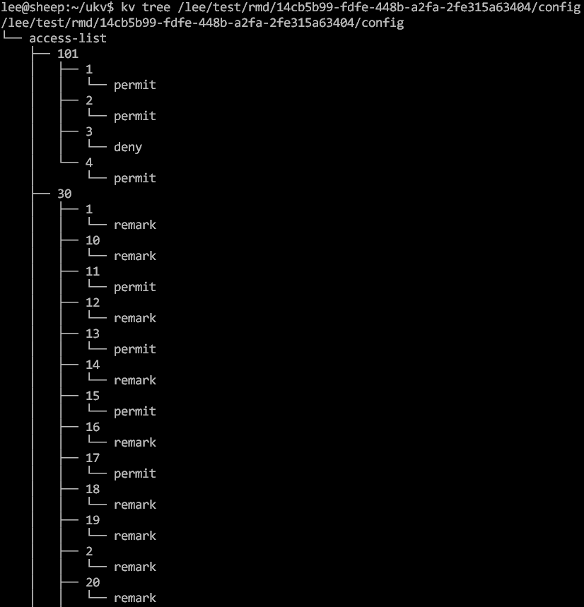

The matching template to (re)generate the CLI configuration would be:

```
<>configure access-list ?/${TENANT_ID}/${REGION_ID}/${ZONE_ID}/${UUID}/config/access-list ?.<>
```

## Other
Base inventory class. Should provide a subset of functionality/attributes (model) required for all devices - extended by respective device types etc.
- May acts as common store for respective device managers
